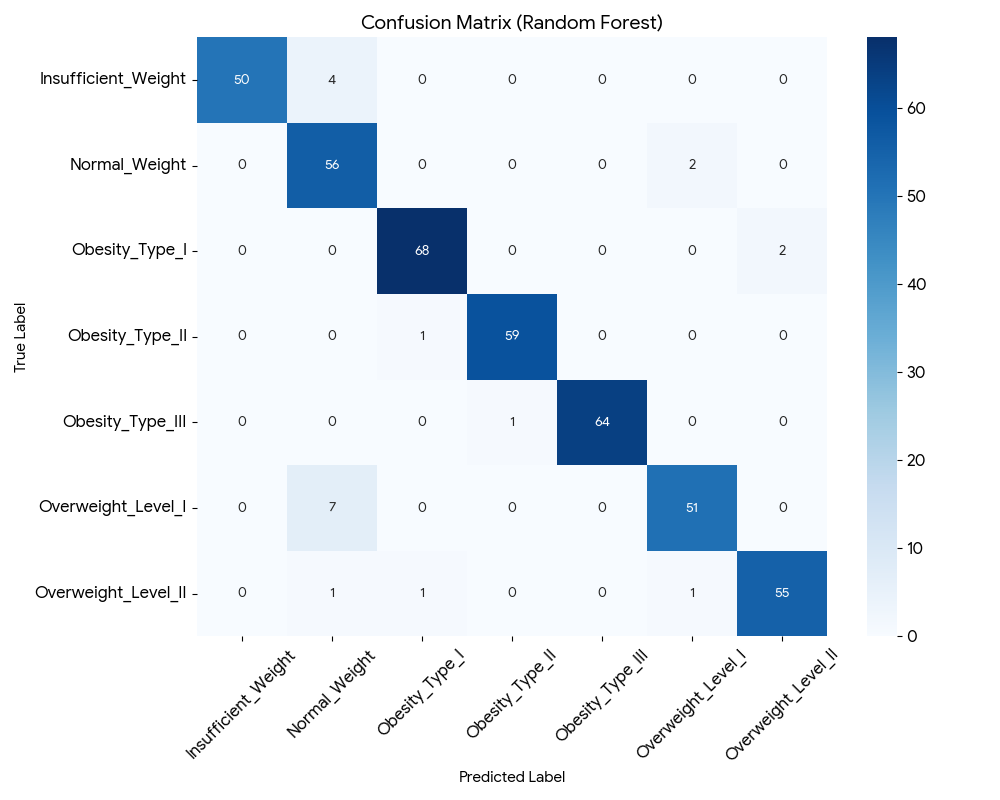
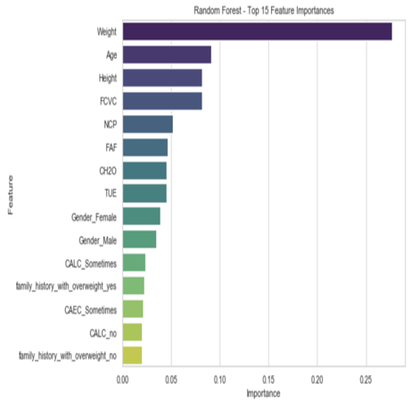
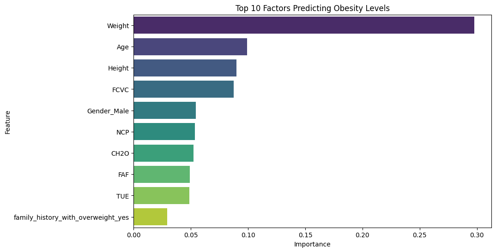
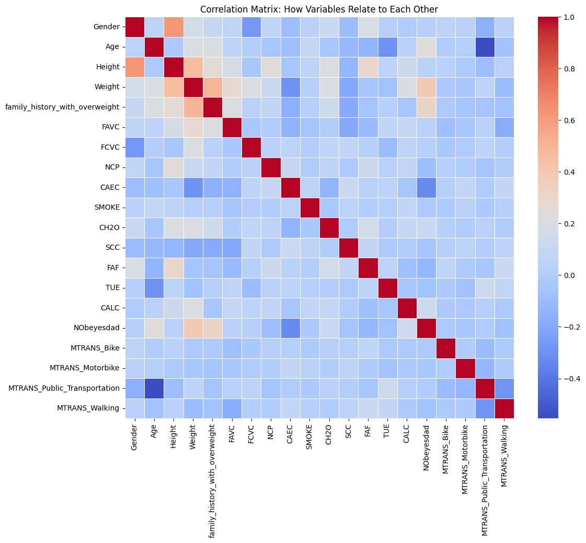
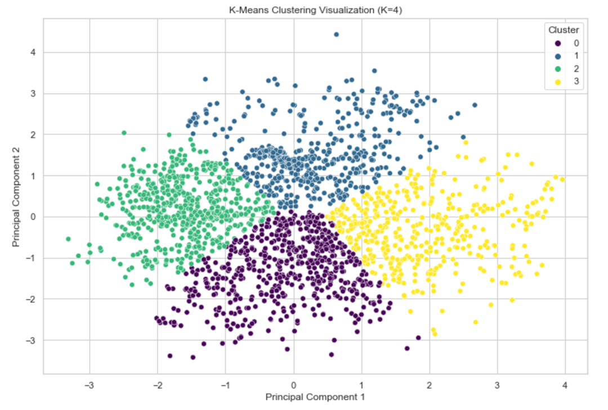

# Predicting Obesity Levels: A Machine Learning Approach 🏥


## 📄 Executive Summary
**The Problem:** Traditional BMI measurements often fail to account for lifestyle factors. Healthcare providers need a more holistic, data-driven way to assess obesity risk based on behavior.

**The Solution:** We built a multi-class classification engine that predicts an individual's obesity level (from "Insufficient Weight" to "Obesity Type III") with **95.3% accuracy**, utilizing lifestyle data from Mexico, Peru, and Colombia.

**Key Impact:**
* **98% Recall for High-Risk Groups:** The model correctly identified nearly all Type III Obesity cases, ensuring critical patients are not missed.
* **Behavioral Insights:** Identified that **Frequency of Vegetable Consumption (FCVC)** and **Number of Main Meals (NCP)** are top predictors, challenging the assumption that "Weight" is the only metric that matters.

---

## 📊 Model Performance

### 1. Model Comparison
We benchmarked Random Forest against a baseline Logistic Regression model. Random Forest proved superior due to its ability to handle non-linear relationships in lifestyle data.

| Model | Accuracy | Precision (Weighted) | Recall (Weighted) |
| :--- | :--- | :--- | :--- |
| **Random Forest** | **95.3%** | **0.96** | **0.95** |
| Logistic Regression | 86.8% | 0.87 | 0.86 |
| Baseline (Guessing) | 14.3% | N/A | N/A |

### 2. Confusion Matrix
The model shows low misclassification rates. Most errors occur between adjacent classes (e.g., misclassifying "Overweight I" as "Overweight II"), which is clinically acceptable.


### 3. Feature Importance
Contrary to simple BMI calculations, our model weighs **Vegetable Consumption (FCVC)** and **Water Intake (CH2O)** heavily, proving diet quality matters as much as quantity.


---

## 🔍 Exploratory Data Analysis (EDA) & Clustering

Before modeling, we performed extensive EDA to understand the data distribution and correlations.

### 1. Distribution of Obesity Levels
The dataset is relatively balanced across the 7 categories, though we used synthetic data techniques (SMOTE) to ensure the "Insufficient Weight" class wasn't underrepresented.


### 2. Feature Correlations
We analyzed the relationships between numerical features. Notable strong correlations exist between **Weight** and **Chest Width**, serving as a proxy for body mass index.


### 3. Patient Segmentation (K-Means Clustering)
We used Unsupervised Learning (K=7) to validate whether patients naturally grouped into 7 clusters without labels.
* **Silhouette Score: 0.42** - Moderate cluster separation, confirming that lifestyle habits create distinct "health profiles."
* **Insight:** While there is overlap, the clusters (colored points) largely align with the specific obesity classes (shapes), suggesting that our 7-class labeling is clinically meaningful.


---

## 🛠 Technical Pipeline

### 1. Data Preprocessing
* **Handling Categoricals:** Applied `LabelEncoder` to 7 categorical variables (Gender, Transportation, etc.).
* **Scaling:** Used `StandardScaler` to normalize continuous features (Age, Height, Weight) for K-Means and Logistic Regression.
* **Synthetic Data Check:** The dataset included synthetic samples (SMOTE-like generation) to balance class distribution, ensuring the model didn't bias toward the majority class.

### 2. Modeling Strategy
* **Split:** 80/20 Train-Test split.
* **Algorithm:** Random Forest Classifier (n_estimators=100) was chosen for its robustness against overfitting.
* **Clustering:** Applied K-Means (K=7) to validate if natural data clusters aligned with clinical obesity categories.

---

## 🌍 Real-World Applications

This model has direct utility in three business sectors:
1.  **Insurance:** Risk adjustment models can incorporate lifestyle inputs (transportation, diet) to better price life and health insurance policies.
2.  **Public Health:** Governments can target interventions. For example, since "Public Transportation" users showed lower obesity rates, city planning can focus on transit accessibility.
3.  **Telehealth Apps:** A "Risk Calculator" API where users input daily habits to receive an instant, personalized health risk assessment.

---

## ⚠️ Limitations & Future Work
* **Synthetic Data Bias:** ~23% of the dataset was synthetically generated to balance classes. While effective for training, real-world deployment would require validation on purely organic clinical data.
* **Geographic Specificity:** Data is sourced from Latin American countries; dietary habits (e.g., "high caloric food") may not generalize to US or Asian populations without retraining.
**Next Steps:** 
- Deploy this model as a **Streamlit Web App** for real-time user testing
- Experiment with **XGBoost** to potentially improve accuracy on minority classes
- Collect longitudinal data to predict obesity *trajectory* over time (not just current state)

---

## 🚀 How to Run This Project

1. **Clone the repository:**
```bash
   git clone https://github.com/kunalrc33xx/obesity-level-prediction-ml.git
   cd obesity-level-prediction-ml
```

2. **Install dependencies:**
```bash
   pip install pandas numpy scikit-learn matplotlib seaborn
```

3. **Run the notebook:**
```bash
   jupyter notebook obesity_prediction_model.ipynb
```

4. **View the full report:** [Download PDF Report](Group-F-Project_Report.pdf)

---
*Project Repository for [Kunal Roy Chowdhury](https://github.com/kunalrc33xx)*
